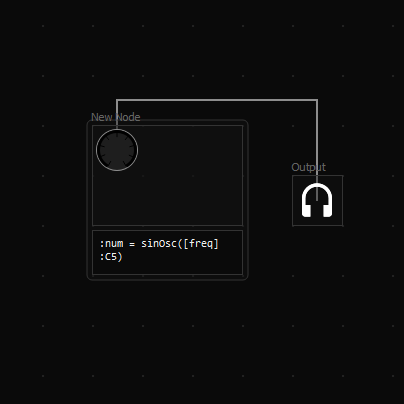

# Axiom [](https://travis-ci.org/monadgroup/axiom)



> A synth built in the current version of Axiom

Axiom is an extremely flexible node-based realtime audio synthesizer. It was originally designed for size-constrained environments such as PC intros in the demoscene, but is entirely open source and is becoming an excellent free tool for any musician.

Features:

 - Musician-friendly (ie knobs and sliders) interface
 - Highly customizable and flexible through a node editor and custom scripting language, named Maxim
 - Export to replayer with no dependencies (not even the standard library)
 - Use any DAW with VSTi support for note editing and automation

There are currently pre-packaged versions available for Windows on [the Releases page](https://github.com/monadgroup/axiom/releases). Stay tuned for macOS and Linux builds!

## Usage Guide

*Coming soon! For now, see the [0.3.0 Release Readme](https://github.com/monadgroup/axiom/wiki/0.3.0-Readme) or check out the [example projects](https://github.com/monadgroup/axiom/tree/master/examples).*

## Backends

Axiom currently supports the following audio backends:

 - Standalone with PortAudio - doesn't require a DAW or host, allowing experimentation with the editor. MIDI input is not currently supported.
 - VST2 - runs in a VST host as an instrument, currently with one MIDI input and one audio output.
 - _Other backends such as VST3 are planned_

## Building

Axiom is built with CMake. The build process depends on Cargo, Qt 5.10 or 5.11, LLVM 6, and the VST 2 SDK (for the VST2 backend), so make sure those are installed and setup correctly.

Once Cargo, Qt, LLVM, and the VST SDK are installed, go to the directory where you'd like to build Axiom to. Then run the following command:

```
cmake ../path/to/source -DVST2_SDK_ROOT=/path/to/vst/sdk
```

If you want to build it statically-linked, pass the `AXIOM_STATIC_LINK` flag:

```
cmake ../path/to/source -DAXIOM_STATIC_LINK=ON -DVST2_SDK_ROOT=/path/to/vst/sdk
```

CMake will setup files necessary for building. If this fails, make sure you've got Cargo, Qt, LLVM, and the VST SDK installed correctly. Once complete, you can choose which backend to build:

To build the VST2 backend, use the following command. You will need to specify a path to the VST2 SDK.

```
cmake --build ./ --target axiom_vst2
```

To build the standalone version as an executable, use the following command. In order to enable audio output in this version, the PortAudio library must be installed. You can still use the standalone editor without it, the graph just won't be simulated.

```
cmake --build ./ --target axiom_standalone
```

## Development

Axiom is comprised of several components:

 - The VST Editor, written with Qt and the VST SDK. This is the only part the user directly interacts with, and must be
   OS-independent. 
 - The Maxim language compiler and runtime, written in Rust with LLVM and statically linked into the editor.
 - The replayer, written in size-optimised C++. Due to it's reliance on Maxim snippets, this must be compiled with
   Clang. The replayer provides a function to fill a buffer, use with the API of your choice.

## License

Licensed under the MIT license. See the LICENSE file in the repository for more details.
